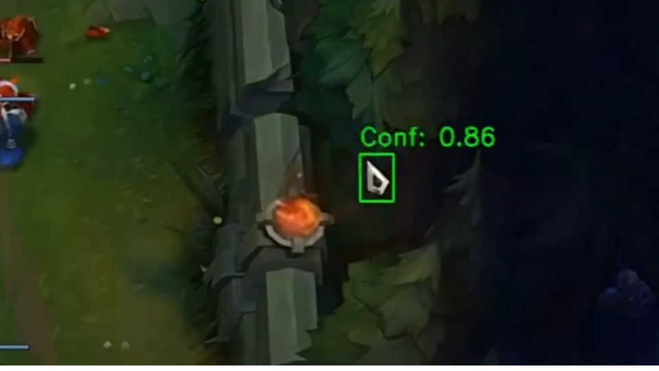
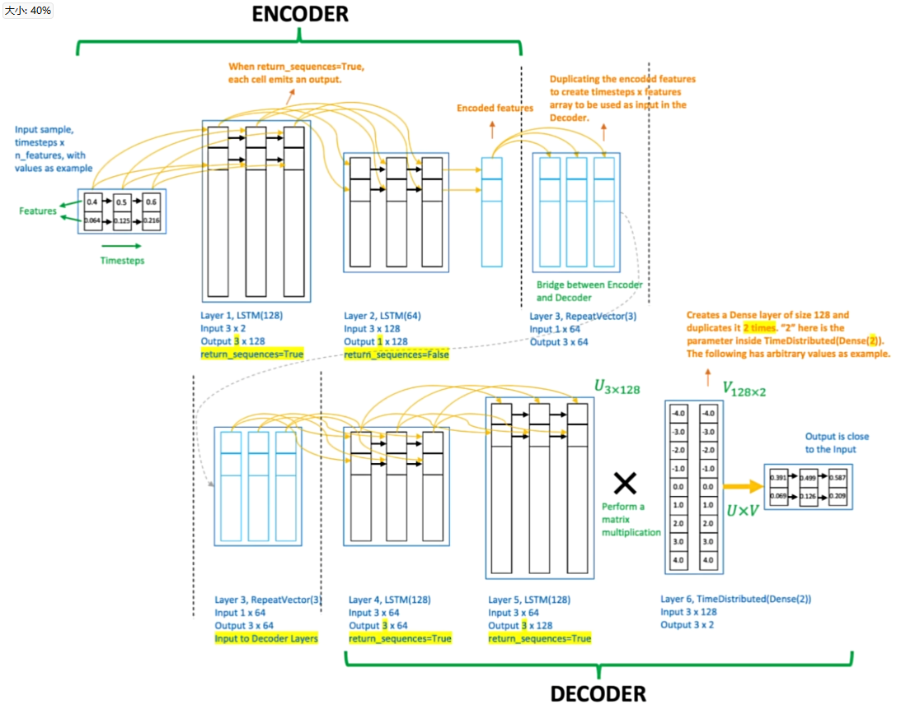
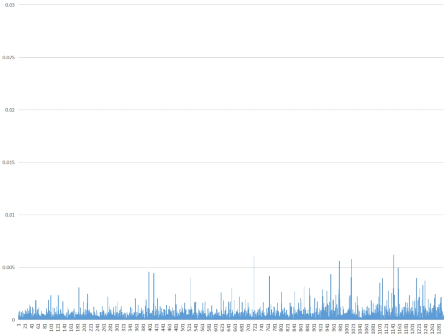
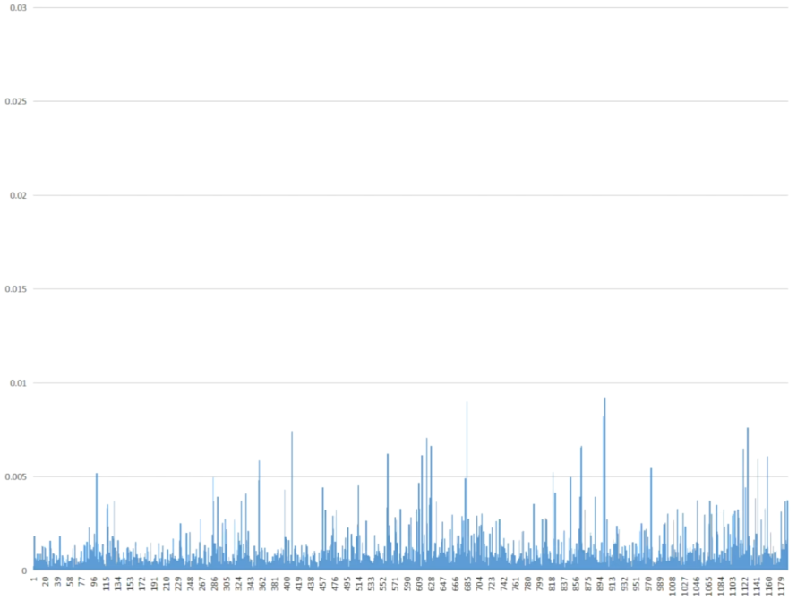
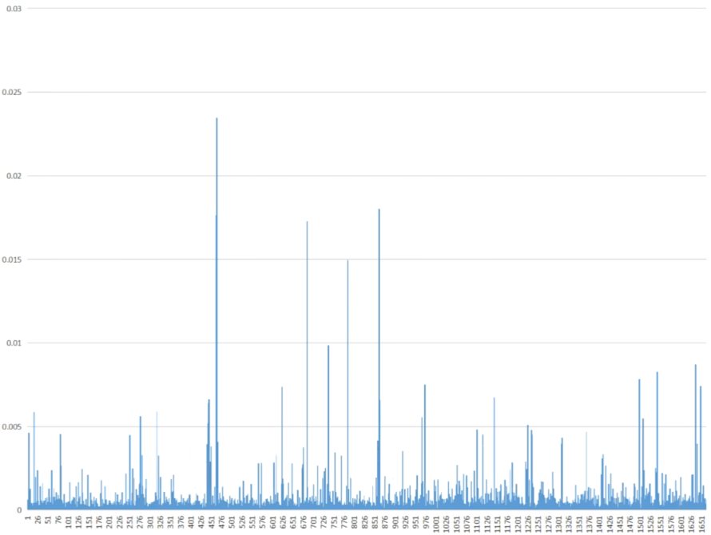

## 🛡️ LoLTrackGuard: Detecting Scripted Behavior in LoL

**LoLTrackGuard** is a lightweight system for detecting suspicious mouse behavior in *League of Legends* gameplay videos. It combines YOLOv8-based cursor detection with an LSTM autoencoder to identify anomalies in cursor movement patterns — no game logs or invasive tools required.

- 🎯 Input: 1080p 30FPS gameplay video
- 🖱️ Step 1: Detect cursor positions using a trained YOLO model
- 📐 Step 2: Extract and normalize motion features (velocity, acceleration, etc.)
- 🧠 Step 3: Feed into LSTM autoencoder to score anomalies
- 📊 Output: CSV with per-second anomaly scores

Trained on real pro player data, LoLTrackGuard offers a non-intrusive way to flag potential automation behavior in gameplay footage.

---

## 📁 Project Structure

```bash
LoLTrackGuard-MAIN/
├── cursor_templates/                # Cursor icon PNGs with transparency (for FakeDataGenerator)
├── model/                           # Trained LSTM models for anomaly detection
│   ├── detection_model.keras        # Default trained LSTM model
│   ├── detection_model2.keras       # Alternate model versions
│   └── detection_model3.keras
├── mouse_positions/                # Output CSVs from cursorDetector with raw mouse position data
├── pipeline/                       # Core logic scripts
│   ├── analyzer.py                 # Runs analysis using a trained model
│   ├── cursorDetector.py          # Detects cursor in videos using YOLO and outputs CSV
│   ├── dataModifier.py            # Extracts motion features and normalizes them
│   └── modelTrainer.py            # Trains LSTM anomaly detection model
├── utils/                          # Resource files and utility scripts
│   ├── cursorDetector_x.pt        # Primary YOLOv8 model for cursor detection
│   ├── FakeDataGenerator.py       # Script to generate synthetic training data for YOLO
│   └── universal_scaler.joblib    # Saved standardizer for feature normalization
├── train_pipeline.py               # Full training pipeline: from video to trained model
├── analyze_pipeline.py             # Full analysis pipeline: from video to anomaly scores
├── requirements.txt                # Python dependencies
└── README.md                       # Project documentation
```

---

## ⚙️ Project Setup

### 1. Install Git LFS (for large model files)

```bash
# Install Git LFS from: https://git-lfs.github.com/
git lfs install
```

### 2. Install dependencies

```bash
pip install -r requirements.txt
```

---

## 🔍 How to Use: Analysis Pipeline (`analyze_pipeline.py`)

### 🎯 Purpose

Detect anomalies in mouse movement from gameplay recordings using a pre-trained model.

> ⚠️ **Important:** Your input video **must be in 1080p 30 FPS** to ensure proper cursor detection and feature alignment.

### 🚀 Run

```bash
python analyze_pipeline.py
```

### 📊 Flow

```
1. Select a video file (e.g. MP4 screen recording with visible cursor)
2. Run YOLOv8 to detect and record mouse positions (X, Y, time)
3. Automatically extract movement features (velocity, acceleration, etc.)
4. Apply the pre-trained scaler to normalize features
5. Feed sequences into LSTM autoencoder
6. Calculate reconstruction error for each 1-second action
7. Save anomaly scores to CSV
```

### 📂 Output

- `analysis_results/`: Contains CSV files listing the reconstruction error per action  
- Each row corresponds to a 1-second sequence (30 frames), indicating anomaly level


## 🧠 Train Your Own Model

If you want to train your own LSTM autoencoder model:

1. Use `pipeline/dataModifier.py` to extract features from your raw mouse position CSV files.
2. Use `utils/universal_scaler.joblib` to normalize the feature vectors.
3. Use `pipleline/modelTrainer.py` to train a new model on the processed sequences.

> 💡 **Tip**: Make sure your input videos are consistently in **1080p 30 FPS**.

---

## 🧪 How This Works

### 1. Cursor Detection via YOLOv8 and Synthetic Data

**Why Cursor?**
The goal of this project is to analyze first-person gameplay footage from streamers or content creators. Compared to character behavior, mouse cursor trajectories provide a more direct and reliable signal for detecting potential scripting.

Collected **mouse pointer** files and **replays of games** as backgrounds

Used `FakeDataGenerator.py` to generate over **70,000 labeled synthetic images**:
- Each frame is overlaid with a randomly selected cursor template
- Cursor size, brightness, saturation, and global blur are randomized

These noisy but labeled images were then used to train a **YOLOv8-based object detection model** capable of detecting mouse positions in real gameplay videos.


---

### 2. Behavioral Modeling via LSTM Autoencoder

To avoid subjective judgment in identifying cheaters, use an **LSTM autoencoder** trained purely on **verified human data** (non-cheating matches).

The model learns to reconstruct **normal human mouse movement patterns**. During inference, it flags any sequences with high **reconstruction error** as potential anomalies, without requiring manual rule definitions.



---

### 3. Feature Engineering with Real Pro Player Data

Collected **50 first-person replays from professional LoL players**, extracting over **1.5 million mouse movements**.

The raw cursor coordinates are processed using `dataModifier.py`, which:
- Extracts engineered features from raw (X, Y) data
- Replaces absolute timestamps with time deltas
- Computes per-frame velocity, acceleration (X/Y), angular velocity, and movement distance
- Applies `universal_scaler.joblib` for normalization

The movements are segmented into **sequences of 30 steps each** (1 second of motion at 30 FPS), representing atomic user actions.

These 500,000+ action sequences are fed into the LSTM for training.

---

### 4. Result Evaluation via Reconstruction Error

After running the full analysis pipeline, the `analyzer.py` script processes the extracted feature sequences using the trained LSTM autoencoder.

For each action (a 1-second sequence of mouse movement), the model calculates a **reconstruction error**:

- **Low error** → behavior is similar to learned human patterns
- **High error** → behavior is abnormal and potentially scripted or assisted

This allows for quantitative, objective evaluation of suspicious gameplay behavior.

The results are saved to `analysis_results/` as CSV files, where each row corresponds to one detected action with its associated anomaly score.



